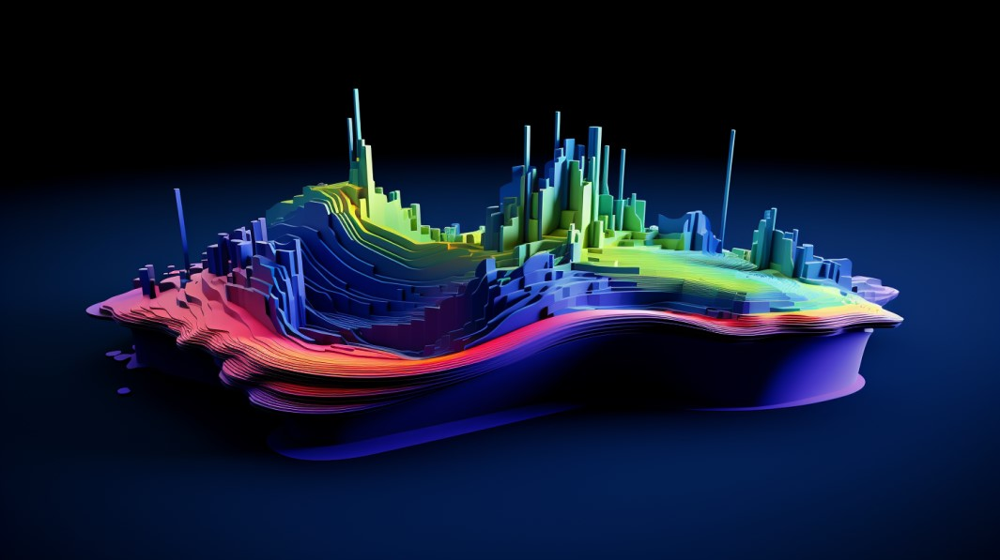
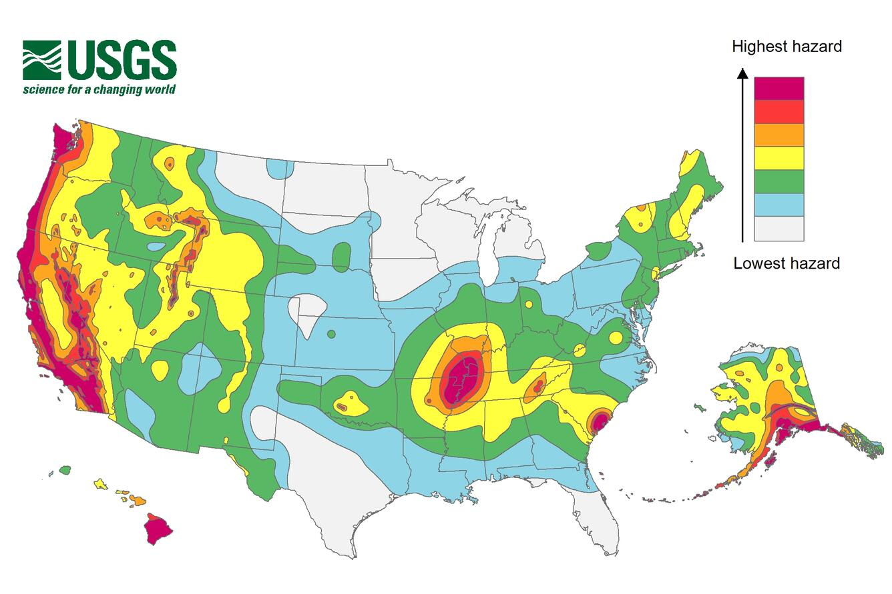
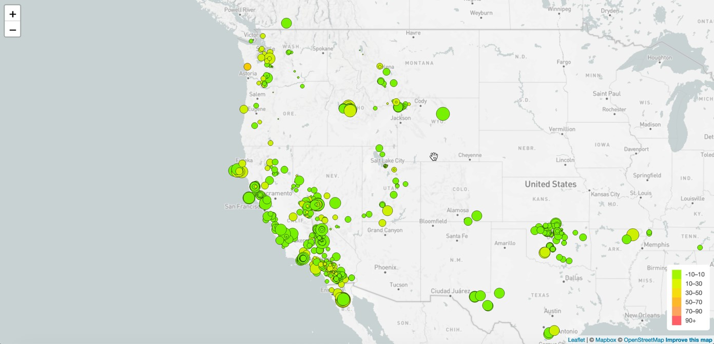
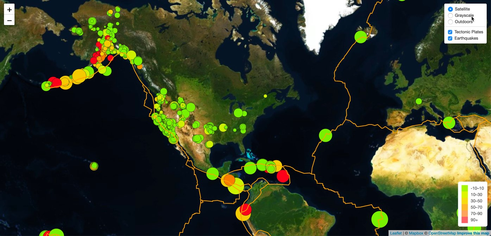
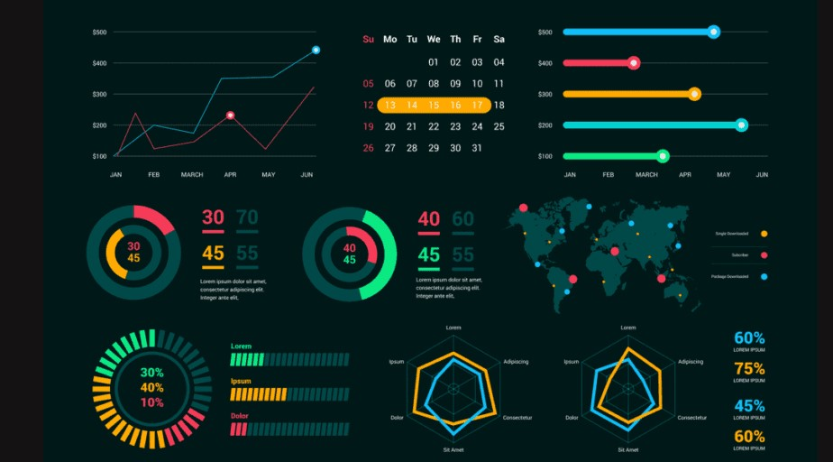

# Earthquake and Topography Visualization using Leaflet.js


## Background
The United States Geological Survey (USGS) is responsible for providing scientific data about natural hazards, 
the health of ecosystems and the environment, and the impacts of climate and land-use changes. 
They develop new methods and tools to provide timely, relevant, and useful information about the Earth and its processes.



USGS collects a massive amount of data on earthquakes from around the world each day, but they lack a meaningful 
way of displaying this data. This project aims to visualize USGS earthquake data, providing the public and other 
organizations with a better understanding of seismic activity across the globe.

## Description
This project visualizes earthquake data using the USGS GeoJSON API and displays it on an interactive Leaflet map. 
It features earthquake magnitude, depth visualization, and topography overlays. 
The second part of the project adds a topographic map and tectonic plates data visualization for enhanced insights.

## Instructions

### Part 1: Create the Earthquake Visualization
1. Visualize earthquake data by fetching the dataset from the USGS GeoJSON feed.
2. Plot the earthquakes based on their longitude and latitude using Leaflet.js.
3. The markers reflect the magnitude of the earthquake by size and the depth by color.
4. Include popups with details on the magnitude, location, and depth when markers are clicked.
5. Add a legend that explains the color coding for earthquake depth.


### Part 2: Gather and Plot More Data (Optional)
- Add tectonic plates data and plot it alongside the earthquake data.
- Allow users to toggle between different map layers (e.g., topographic map, street map).
- Enable overlays for the tectonic plates and earthquake data to be turned on or off independently.


## Code Example
Below is a snippet showing how the earthquake markers are created and added to the map:

```javascript
function createMarkers(feature, latlng) {
    return L.circleMarker(latlng, {
      radius: feature.properties.mag * 4, // Set marker size based on magnitude
      fillColor: getColor(feature.geometry.coordinates[2]), // Color based on depth
      color: "#000",
      weight: 1,
      opacity: 1,
      fillOpacity: 0.8
    }).bindPopup(`<h3>Magnitude: ${feature.properties.mag}</h3><p>Location: ${feature.properties.place}</p><p>Depth: ${feature.geometry.coordinates[2]} km</p>`);
}
```


## Technologies Used
- Leaflet.js
- D3.js
- HTML
- CSS

## License
This project is part of the UofT Bootcamp challenges.
